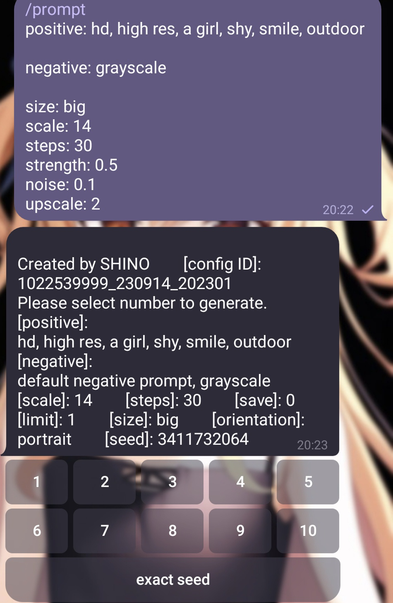
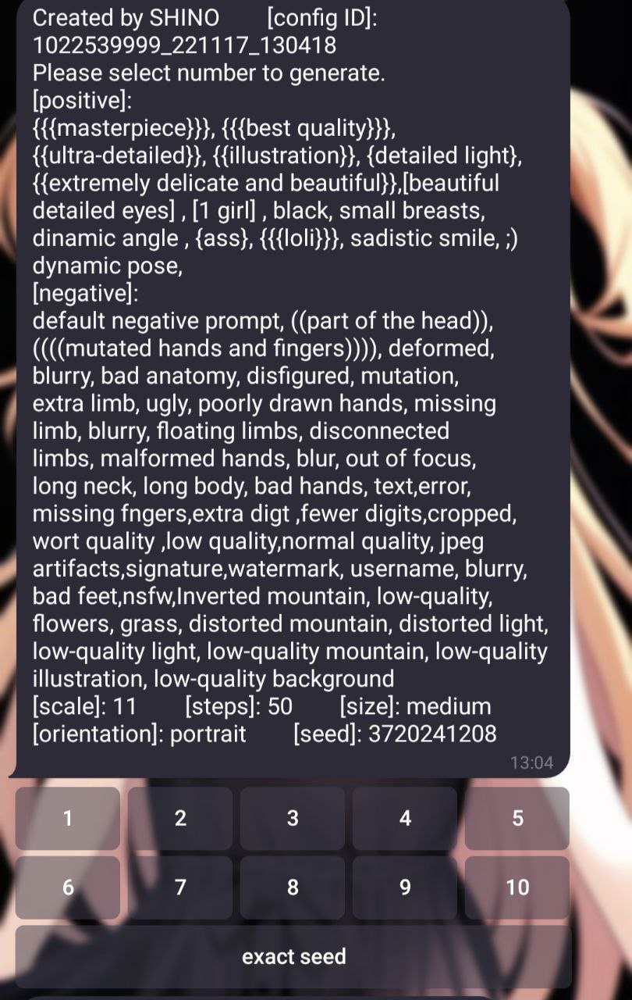
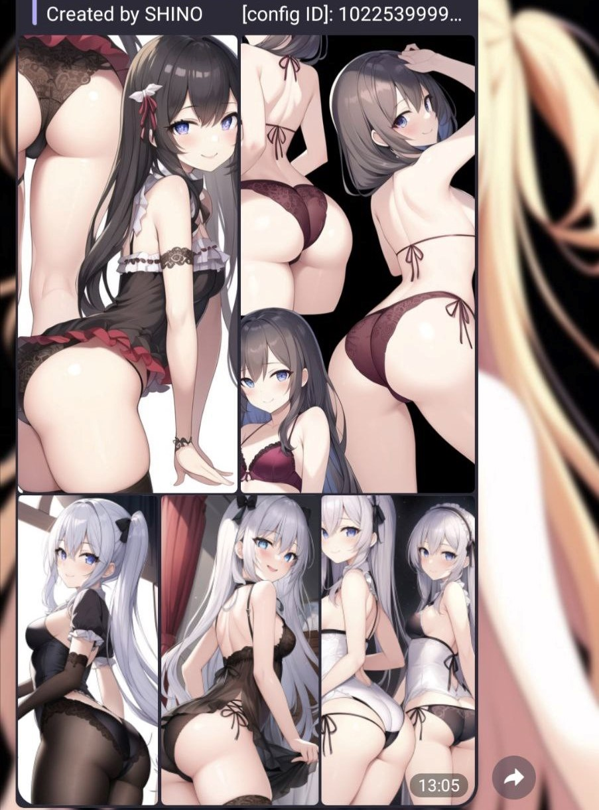

# Naifu Telegram Local Bot
 
Simple telegram bot to connect your local Naifu environemnt if you run in your own PC (using your own GPU).\
You can also do some adjustment to connect to the the official Novel Ai Diffusion.\
\
To run it, first add your Telegram Bot token in .env file
```
TOKEN='<your token>'
BASE_URL='<your AI api>'
```
Then use `yarn build` or `npm run build` to start the program (or click the `run.bat`)

---

Input
---
use ```/prompt``` in message along with:\
`positive:` prompt\
`negative:` prompt\
`sizes:` small | medium | large | largest | big | big2 (or define it by yourself in config file)\
`orientation:` portrait | landscape | square\
`steps:` number\
`scale:` number\
`strength:` number\
`noise:` number\
`upscaler:` number\
`seed:` number (only support when using exact seed button)\
\
Each input options must be separated by newline, or it will be considered as same property\
e.g. 
```
/prompt
positive: something...
negative: something...
scale: 7
steps: 28
size: big
```
\
Support default negative prompt.\
\
For img2img, choose an image and input the caption with same format.\
Oversize image will be adjusted to smaller size.\
\
\
\
\
\
The exact seed will strictly use your input seed to generate. Otherwise each time will be created by a new random seed.\
\
